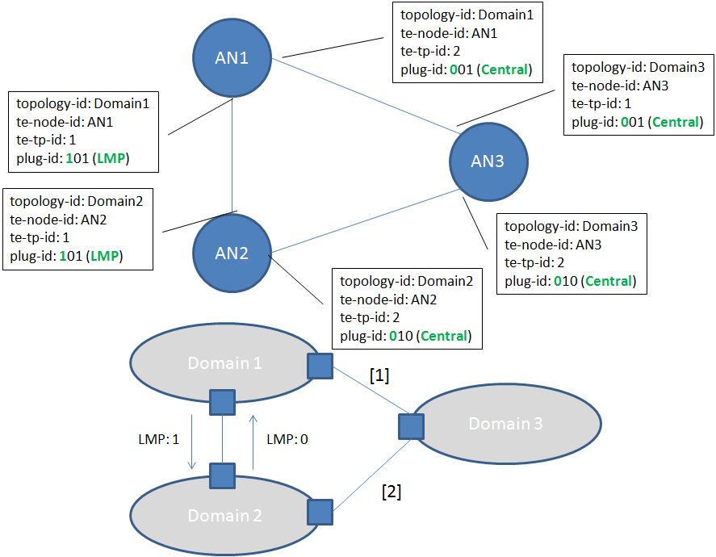
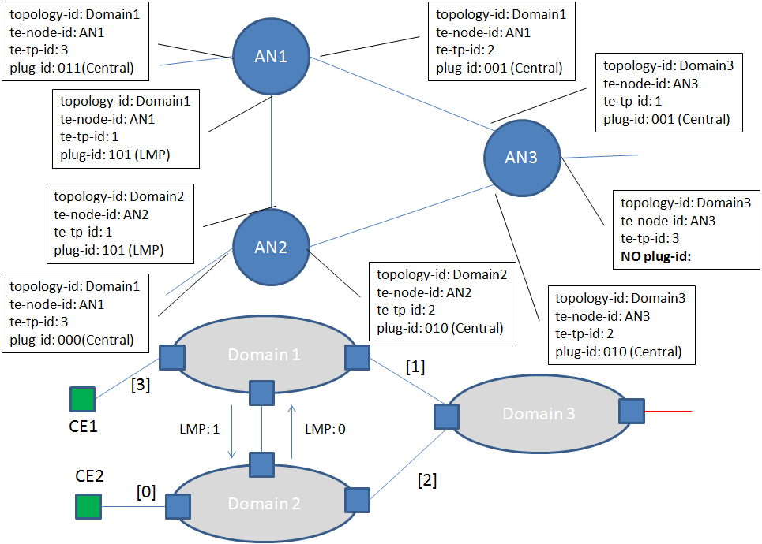

# Weekly Call (October 18, 2017)

## Attendees

- Italo Busi  
- Sergio Belotti  
- Carlo Perocchio  
- Dieter Beller  
- Gianmarco Bruno  
- Igor Bryskin  
- Oscar Gonzales de Dios  
- Yunbin Xu  
- Young Lee  
- Yuji Tochio

## Agenda:

1) Use Case 3 Analysis: discussion about inter-domain link stitching  
2) Use Case 1 Analysis: I2RS topology attributes  
3) Use Case 1 Analysis: TE Tunnel attributes for ODU2 transit service  
4) AOB  

## Meeting Notes:

### 1) Use Case 3 Analysis: discussion about inter-domain link stitching

Plug id with LMP: you can extends LMP to carry e.g. IP address form 1 border node to the othee of E-NNI. IP addr , need to belong to the same name space. Igor suggest that plug id is  aporperty of LTP not of te-link overcoming the problem of unidirectional link: LTP is bidirectional by definition.   

The plug-id definition can be changed to be a variable-length bit string: the auto-discovered information can therefore be encoded into the plug-id.  

In a  Central registry you can have the plug id registration to assure this is unique.  This method remains valid , second option is LMP.  
The  plug-id dicovered via LMP has to be anyway coordinated with the central registry maintaning the "store" of the global plig-id.  

An alternative option, to allow co-existence of central authority with auto-discovery and/or multiple audo-discovery mechanisms, is to partition the plug-id namespace into different namespaces: one for the central authority and one for each auto-discovery mechanism.  
You need to advertise the same plug-id independently of the topology (physical or abstract e-g- virtual-node ). E.g. we cannot use node-id for plug-id since would be different with resepct a real physical topology and an abstract topology .  

**Action: Raise the comment to make plug-id a variable-length bitstring and to associated it to the LTP other than to the Link to the TE Topology authors**  

Young example: co-existence of dynamic auto-discovery (e.g., LMP) with central assignment of plug-id values (with partitioning of the plug-id namespace between LMP and central authority):  

Yunbin reported that in practical implementation, four types of links can be identified:  
    - intra-domain links having both source-tp and destination-tp  
    - inter-domain links having only the source-tp (no destination-tp) and the plug-id  
    - access links, connected with a CE device, having only the source-tp (no destination-tp) and the plug-id  
    - access links, not connected with any CE device, having only the source-tp and no destination-tp nor plug-id  

**Discussion to be continued on the mailing list and on the next DT call**  

### 2) Use Case 1 Analysis: I2RS topology attributes

Initial proposal for I2RS attributes uploaded on GitHub:

[https://github.com/danielkinguk/transport-nbi/pull/10](https://github.com/danielkinguk/transport-nbi/pull/10)  

Not discussed because of lack of time.  

**Discussion to be started on the mailing list and on the next DT calls.**  

### 3) Use Case 1 Analysis: TE Tunnel attributes for ODU2 transit service

Proposed updates to the JSON code uploaded on GitHub:

[https://github.com/danielkinguk/transport-nbi/pull/11](https://github.com/danielkinguk/transport-nbi/pull/11)  

Not discussed because of lack of time.  

**Discussion to be started on the mailing list and on the next DT calls.**  

### 4) AOB

## Note Takers

- Italo Busi  
